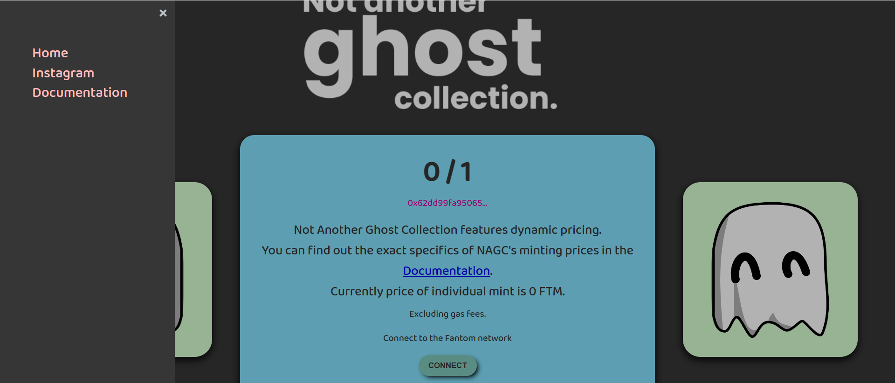

Not Another Ghost Collection (NAGC) 是建立在 Fantom 网络上的生成艺术收藏，具有讽刺意味的是由鬼魂、食尸鬼和偶尔出现的收割者组成。

Not Another Ghost Collection (NAGC) 是建立在 Fantom 网络上的生成艺术收藏，具有讽刺意味的是，由幽灵、食尸鬼和偶尔的收割者组成，创建了 VagrantTea。

共有 10,000 只鬼魂、食尸鬼和收割者，目前正在铸造中。该系列的定价方式使新来者可以使用，前 5000 枚薄荷糖为 5 FTM 或以下。

