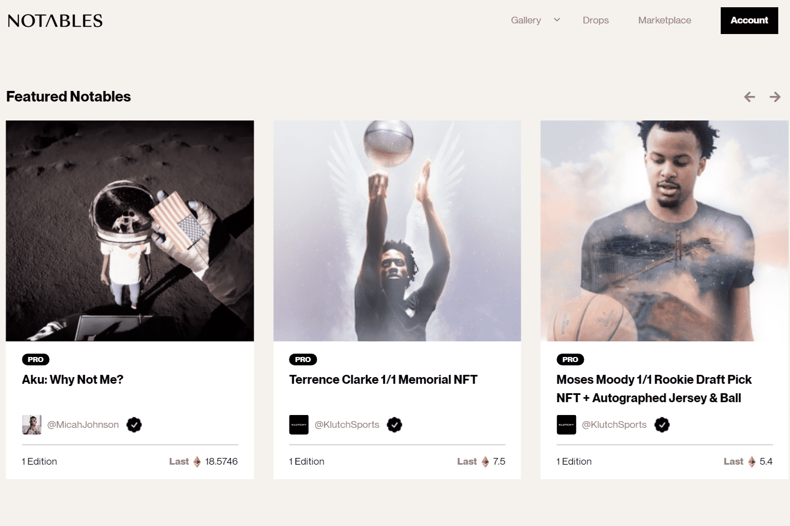

Notables 是一个高度策划的 NFT 平台和市场，致力于优质内容的世界。以可访问性、易用性和可持续性为首要考虑，其用户能够在唯一完全碳中和的 NFT 生态系统上以加密货币和美元进行交易。

Notables 是世界上最令人梦寐以求和堪称典范的 NFT 的新数字市场。我们与定义文化的创意和标志性 IP 合作，为买家和卖家提供安全、持久的价值。我们对优质内容世界的承诺意味着我们的内部技术和文化专家团队会考虑、策划和情境化每个项目。

Notables 是一个高度策划的 NFT 市场，它优先考虑质量而不是数量。我们致力于使用优质内容，这意味着我们的内部技术和文化专家团队会考虑、策划和情境化每个项目。

