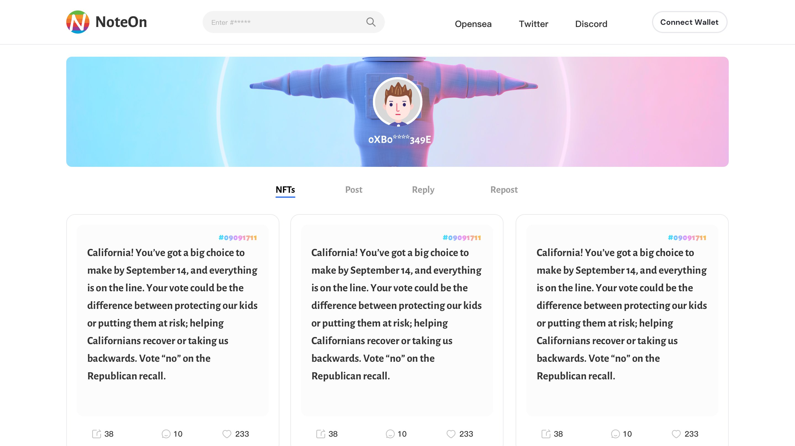

每个人都可以写一些文字并将其铸造为 NFT。它完全免费，除了 gas 费。目前，NoteOn 在 BSC、以太坊和 Polygon 上运行。铸造 NFT 对应的 gas 费为 0.001BNB、0.01ETH 和 0.02MATIC。

每个人都可以加入 NFT 趋势，并以 NFT 的形式进行交易。语言是一门高水平的艺术。此外，我们预见未来每个人都在一个去中心化的社交网络上讨论和讨论，其中 NFT 是沟通、结交朋友等的核心媒体。

