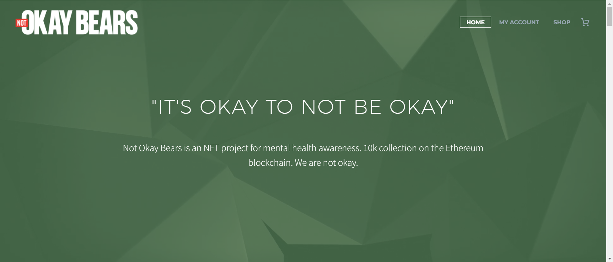

不好的熊

Not Okay Bears 于 2022 年 5 月 14 日推出。在其启动后的 24 小时内，该项目售罄并达到 4,000 ETH 交易量，这导致 Not Okay Bears 在 OpenSea.io、X2Y2.io 和 LooksRare.org 上的活动排名第一。社区很强大，联系很紧密，每天有很多人在心理健康方面得到帮助，这是 NFT 社区所需要的巨大积极影响。在需要的时候，我们会认真对待事情，但我们喜欢开玩笑和玩乐。一个真正具有竞争力的性质和充满乐趣的社区。

