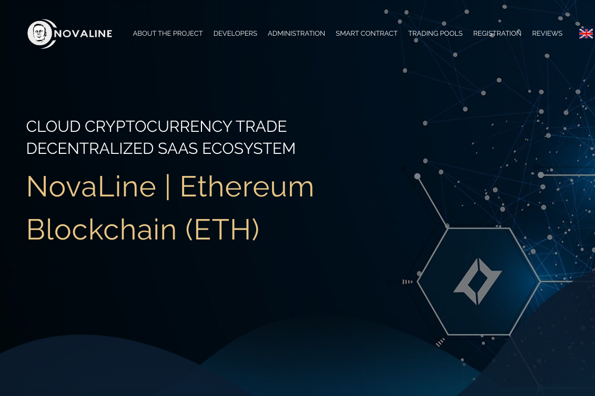

PolyPoly Enterprise GmbH 公司开发用于货币、股票和加密货币市场交易的人工智能。是一家由IT与自动化、金融与银行、远程交易三位专家创立的金融科技公司。十多年来，我们一直在成功开发、实施和使用金融科技和人工智能技术。

NovaLine 是 PolyPoly 为股票市场交易创建人工智能的工具，年收益率为 112% 由于我们的存款模型，投资者通过已成功工作和开发超过 10 年的证券交易所机器人的工作获得被动收入年。今天，全球趋势令人恐惧，全球自动化正在发生，很快就不会有简单的职业，如：司机、机械师、清洁工、推销员，甚至需要高能力的职业，翻译、销售经理、旅行社...人在很大程度上被机器人所取代，我们也跟上了时代的步伐。我们提供通过投资发展中的行业来保护自己免受财务失败的影响，并在全球趋势下获得被动收入.

