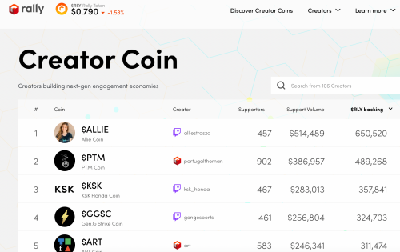

Rally 是创作者及其社区建立自己独立的数字经济的平台。由一个对创造者经济具有丰富行业知识的团队创立，并以先进的安全基础设施为后盾。

创建硬币不需要任何加密知识。任何人都可以在几分钟内用信用卡购买硬币。

Rally 不收取任何费用，对环境影响低，不需要加密经验，并且与您的平台无缝集成。

借助 Rally，创作者和他们的社区可以以他们从未想过的方式进行协作，从而激发更深入、更有意义的关系

