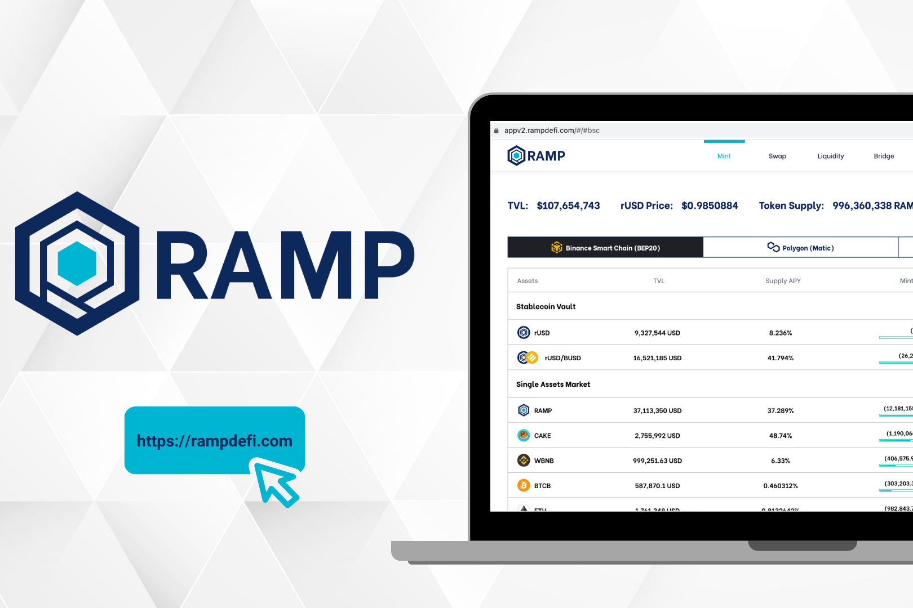

RAMP DEFI 是一个优化的抵押稳定币借贷平台，通过在 Binance Smart Chain 和 Polygon 中释放稳定币流动性并同时获得高收益，以及包括 Ethereum、Solana 和 Polkadot 在内的新区块链网络，帮助用户充分利用其加密资产的价值将在不久的将来整合。

加密资产所有者可以存入抵押资产以获得高收益，借入可以用作跨链流动性的 rUSD 稳定币，同时获得净正收益，从而在保持资产生产力的同时提取流动性。有了这个，他们将不再将资本束缚在非流动性资产所有权头寸上，同时实现最大的资本效率。

