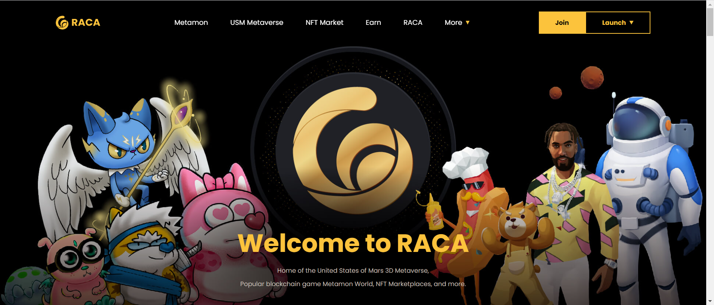

Rare Metamon 是 11,646 个独特的 Metamon NFT 的集合。他们是RadioCaca（RACA）在BNB链上设计的基于区块链的游戏“Metamon World”中供应有限的主要角色。作为玩家，您可以控制和收集超级可爱的稀有 Metamons。

在激动人心的区块链游戏中，用您的 Metamon NFT 角色孵化、收集、训练和战斗其他玩家

RACA 于 2021 年 5 月推出，是一个社区驱动的去中心化 自治组织 (DAO)。RACA拥有庞大且经验丰富的 开发团队、数百名社区志愿者和庞大的粉丝群， 已成为领先的 Web 3.0 解决方案提供商。我们是一个 人民的 DAO，从一开始就与我们的社区在一起。

