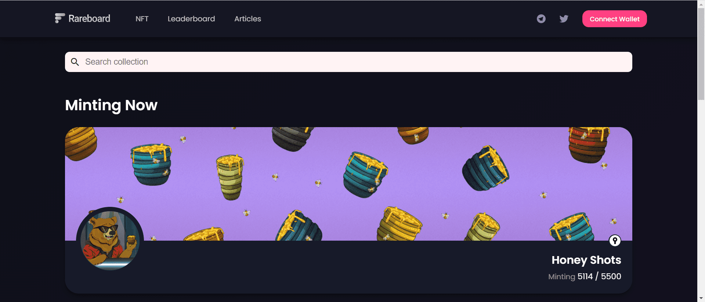

---
title: "Rareboard"
description: "Rareboard 是为 BNB 链及其他平台构建的 NFT 市场聚合器和稀有仪表板"
date: 2022-08-22T00:00:00+08:00
lastmod: 2022-08-22T00:00:00+08:00
draft: false
authors: ["浮尘"]
featuredImage: "rareboard.png"
tags: ["Marketplaces","Rareboard"]
categories: ["nfts"]
nfts: ["Marketplaces"]
blockchain: "BSC"
website: "https://www.rareboard.com/"
twitter: "https://twitter.com/rareboard"
discord: "https://discord.com/invite/SVEpK2NsUm"
telegram: "https://t.me/rareboard"
github: ""
youtube: ""
twitch: ""
facebook: ""
instagram: ""
reddit: ""
medium: ""
steam: ""
gitbook: ""
googleplay: ""
appstore: ""
status: "Live"
weight: 
lightgallery: true
toc: true
pinned: false
recommend: false
recommend1: false
---
Rareboard 的使命是为收藏家提供在 BNB 链 NFT 空间中取得成功所需的唯一平台。作为 NFT 市场聚合器，我们致力于提供精确的 NFT 数据、全面的铸造机会以及买卖双方之间的每一个可能的联系，以实现准确的价格发现和增加交易量。

为#BNBChain构建的 NFT 市场聚合器| 来自多个市场的铸币和交易 NFT，无需额外费用。

