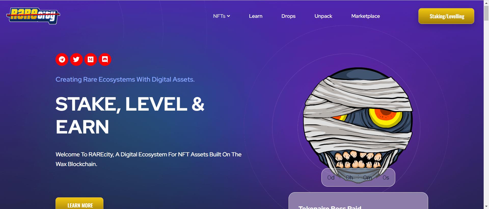

欢迎来到建立在 Wax 区块链上的 NFT 资产数字生态系统 RAREcity。探索我们不断扩大的 NFT 资产集合、资产商店和由 RARc 代币提供支持的新 RAREcity NFT 质押/平衡平台。

当 RAREcity NFT 被铸造或转移时，它们会自动被质押到收件人钱包中，检查 RAREcity Dapp 以查看哪些资产被质押。

代币供应量：10,000,000,000
RARc 代币是按需铸造的，只能通过 Staking 解锁，总供应量将从 0 开始，直到 100 亿个代币全部铸造完毕。

RARc 代币将作为对想要扩展其数字收藏帝国的 NFT 持有者的奖励，RARc 代币在购买和平衡 RAREcity 生态系统中可用的 NFT 资产之外没有任何内在价值。

RARc 代币将主要用于在 RAREcity Dapp 的商店部分购买可用的 NFT，或用于平衡默认质押率。 

– 50% 的代币被烧毁

– 50% 被发送到 RARc 钱包，用于空投开发和未来的 Dapps。

