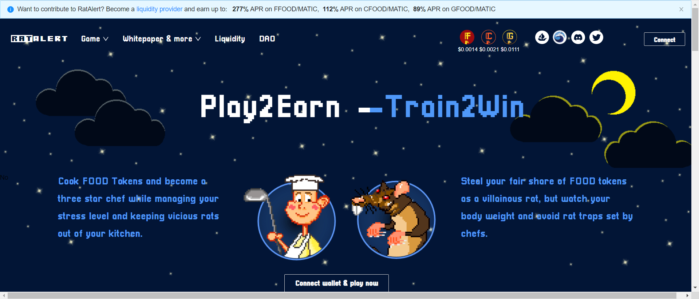

---
title: "RatAlert"
description: "在 play2earn 游戏 RatAlert 中扮演烹饪企业家的角色并训练您的厨师和老鼠厨房团队，以最大限度地提高您的食物代币收入！"
date: 2022-08-22T00:00:00+08:00
lastmod: 2022-08-22T00:00:00+08:00
draft: false
authors: ["浮尘"]
featuredImage: "ratalert.png"
tags: ["NFT Games","RatAlert"]
categories: ["nfts"]
nfts: ["NFT Games"]
blockchain: "Polygon"
website: "https://ratalert.com/"
twitter: "https://twitter.com/RatAlertNFT"
discord: "https://discord.com/invite/RatAlert"
telegram: ""
github: "https://github.com/ratalert"
youtube: ""
twitch: ""
facebook: ""
instagram: ""
reddit: ""
medium: "https://ratalert.medium.com/"
steam: ""
gitbook: ""
googleplay: ""
appstore: ""
status: "Live"
weight: 
lightgallery: true
toc: true
pinned: false
recommend: false
recommend1: false
---
巴黎 - 这是一个有抱负的创业厨师走向顶峰的城市。只有极品奶油才能打造自己的 GourmetFood 厨房，例如 Metaverse 中著名的 3 星级餐厅 LeStake©。扮演烹饪企业家的角色，打造你的厨房团队！

play2earn NFT 游戏 RatAlert 可让您在链上训练您的角色，以增加您在 3 个不同厨房的食物代币质押收入。通过购买您自己的厨房并升级它们以避免挫折，成为 RatAlert 元宇宙的一部分。将多余的厨房空间出租给其他玩家，让您的角色在尊贵的 555 俱乐部度过美好时光。

RatAlert 是一个动态的元节，由社区通过 RatAlert DAO 管理。

