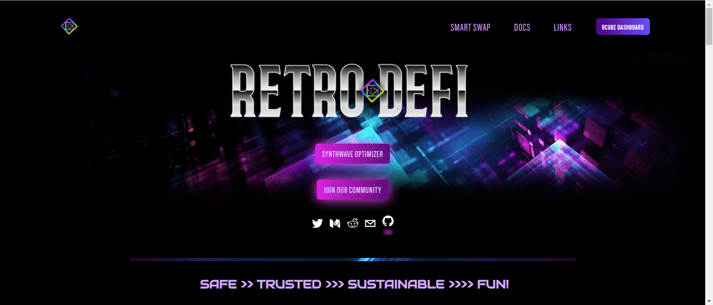

RCUBE V2 是 RETRO DEFI 生态系统的下一次进化。它结合了 DEFI 2.0 机制和 REBASE 协议的最新技术。

我们称其为 RAC 协议或 RCUBE 自动复合协议。

RAC 协议赋予 RCUBE 持有者通过持有钱包进行自动质押和自动复利的能力。这种复杂的协议保证至少 10,000% 的 APY 或至少 0.2552% 的每日投资回报率。

与 RCUBE 类似，RAC 协议使用正向 rebase 公式，使得每日代币分配与每日 rebase 奖励成正比成为可能，其价值至少为您钱包中持有的代币总量的 0.2552%。

rebase 奖励在每个 rebase 期间分配给所有持有者。这意味着，在不从钱包中转移代币的情况下，RCUBEV2 持有者将根据钱包中的代币数量获得至少 10,000% APY 的年度复利。

每次买卖都将被收取 RAC 协议实施的税款，该税款将使用 2 个外部可持续性层来维持整个奖励分配和协议的长期运行。这两层是 RLI（RCUBE 流动性注入）和 RTV（RCUBE 库房）。

购买税 = 5%

卖税= 10%

