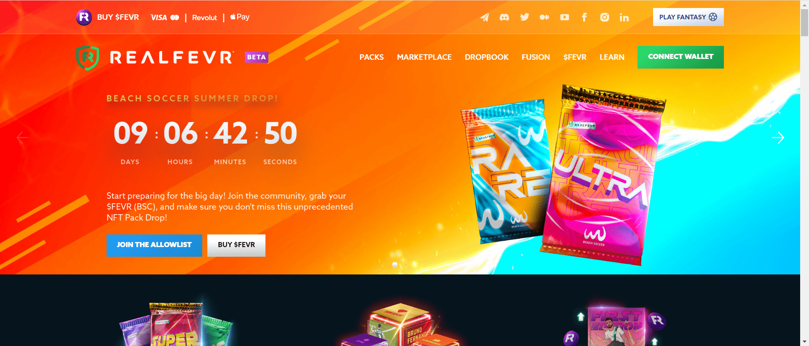

---
title: "RealFevr"
description: "第一个足球视频 NFT 市场，官方授权。"
date: 2022-08-22T00:00:00+08:00
lastmod: 2022-08-22T00:00:00+08:00
draft: false
authors: ["浮尘"]
featuredImage: "realfevr.png"
tags: ["Collectibles","RealFevr"]
categories: ["nfts"]
nfts: ["Collectibles"]
blockchain: "BSC"
website: "https://www.realfevr.com/"
twitter: "https://twitter.com/realfevr"
discord: "https://discord.com/invite/realfevr"
telegram: "https://t.me/realfevrofficial"
github: ""
youtube: "https://www.youtube.com/c/realfevrtv"
twitch: ""
facebook: "https://www.facebook.com/login/?next=https%3A%2F%2Fwww.facebook.com%2FRealFevr"
instagram: "https://www.instagram.com/realfevr/"
reddit: ""
medium: "https://realfevr.medium.com/"
steam: ""
gitbook: ""
googleplay: ""
appstore: ""
status: "Live"
weight: 
lightgallery: true
toc: true
pinned: false
recommend: false
recommend1: false
---
RealFevr 是一家于 2015 年在幻想市场成立的公司，其足球 P2E 手机游戏目前在 App 和 Play 商店的下载量超过 200 万。随着梦幻联赛的概念现已得到证实，RealFevr 正在通过推出首个由 IP 完全支持的足球视频 NFT 市场，成为 NFT 市场的领导者。NFT 也将被集成到手机游戏中。代币 $FEVR 是 RealFevrs 生态系统的燃料，因为它是 Play2Earn 移动游戏的奖励，也是 NFT 市场的货币。

