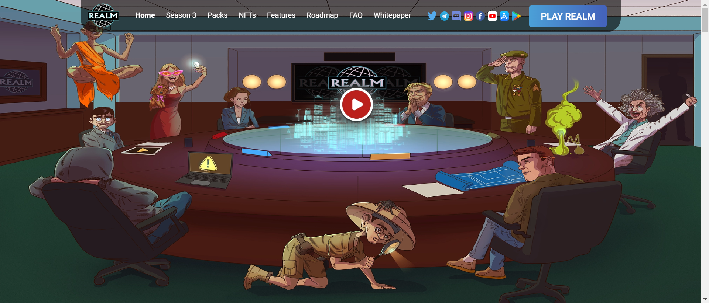

Realm 是一款资源管理游戏，您可以在其中战略性地利用您的 NFT 领导者来拯救世界免受破坏。玩家将收集资源、解锁区域、获得 RLM 代币、升级他们的领域等等。核心游戏围绕着一个不那么遥远且不那么虚构的未来展开，世界因战争、饥荒、疾病和流星而处于动荡之中。现任领导人正在失败并失去控制。一个名为 Realm 的秘密组织正在组建一个团队，以使世界恢复秩序。玩家将能够战略性地建立他们的 Realm 团队，最终目标是恢复每个地区的秩序。这并不容易，并且需要玩家采取大量策略来选择何时何地利用每个领导者来发挥他们的独特优势。

