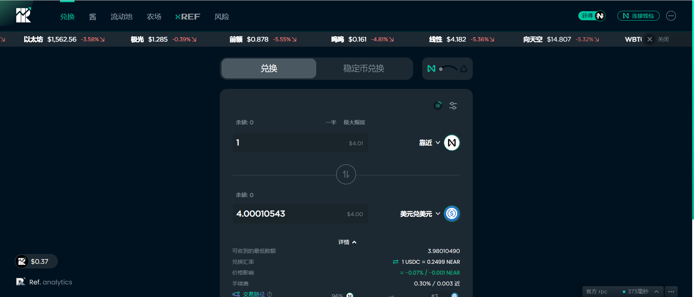

---
title: "Ref Finance"
description: "Ref Finance 是一个基于 NEAR 协议的社区主导的多用途去中心化金融 (DeFi) 平台。"
date: 2022-08-22T00:00:00+08:00
lastmod: 2022-08-22T00:00:00+08:00
draft: false
authors: ["浮尘"]
featuredImage: "ref-finance-1.png"
tags: ["Exchanges","Ref Finance"]
categories: ["nfts"]
nfts: ["Exchanges"]
blockchain: "NEAR"
website: "https://app.ref.finance/"
twitter: "https://twitter.com/finance_ref"
discord: ""
telegram: ""
github: ""
youtube: ""
twitch: ""
facebook: ""
instagram: ""
reddit: ""
medium: ""
steam: ""
gitbook: ""
googleplay: ""
appstore: ""
status: "Live"
weight: 
lightgallery: true
toc: true
pinned: false
recommend: false
recommend1: false
---
Ref 充分利用了 NEAR 的低费用（每次交换 0.005 美元）、一到两秒的确定性和基于 WebAssembly 的运行时（你好，Rust 智能合约！）。

使用最近推出的彩虹桥（NEAR <> ETH），交易者可以利用来自以太坊的数十亿美元的符合 ERC-20 标准的资产，最终来自任何链（BSC、Polygon/Matic、Cosmos/IBC 等）在 NEAR 上。

Ref Finance 的第一个产品是自动做市商 (AMM)。它类似于 Uniswap，但有一些变化： - 单个合约中的多个池。交易者可以在单笔交易中以原子方式跨矿池进行交易——每个矿池可定制的 LP 费用。LP 可以对非流动性或高度波动的代币收取更高的费用。掉期的推荐费，目前设定为 1 个基点。开发人员可以通过在 Ref Finance 之上构建 UI 和其他应用程序来获得奖励

