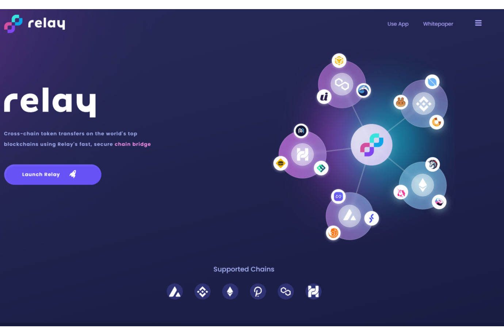

---
title: "Relay Chain"
description: "使用 Relay 快速、安全的链桥在世界顶级区块链上进行跨链代币传输"
date: 2022-08-22T00:00:00+08:00
lastmod: 2022-08-22T00:00:00+08:00
draft: false
authors: ["浮尘"]
featuredImage: "relay-chain.png"
tags: ["DeFi","Relay Chain"]
categories: ["nfts"]
nfts: ["DeFi"]
blockchain: ""
website: "https://www.relaychain.com/"
twitter: "https://twitter.com/relay_chain"
discord: "https://discord.gg/relaychain-botb"
telegram: "https://t.me/relaychaincommunity"
github: "https://github.com/RelayChain"
youtube: "https://www.youtube.com/channel/UC8q_XLKQtI-x5PUa4Rg3RrQ"
twitch: ""
facebook: ""
instagram: ""
reddit: "https://www.reddit.com/r/RelayChain/"
medium: ""
steam: ""
gitbook: ""
googleplay: ""
appstore: ""
status: "Live"
weight: 
lightgallery: true
toc: true
pinned: false
recommend: false
recommend1: false
---
Relay 通过将跨链互换集成到流行的 DEX、CEX、dApp 和钱包中，允许交易者同时进入多个市场，带来新的套利机会并增加对有利可图的交易的敞口。对于我们其他人来说，Relay 意味着我们可以在区块链之间简单、安全和快速地移动加密货币，让大众可以访问跨链 DeFi。因为Relay 是一项服务，你甚至可能不知道你在使用它，但 Relay 是 DeFi 的首屈一指的桥梁，统一了去中心化的世界并奖励提供帮助的持有者。

Stake Relay 并直接以原生 gas 代币（ETH、BNB、AVAX、HT、MOVR、MATIC）赚取 Bridge 费用

