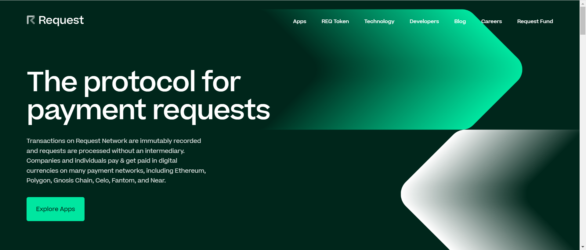

Request (REQ) 是一套基于区块链的金融应用程序套件，专用于加密优先的公司。Request Invoicing 允许从自由职业者到小型企业和组织的任何人在通用、分散的网络中创建、存储和访问发票和收据。 

Request 旨在成为领先的金融 dApp，为 DAO、基于区块链的公司和承包商提供 DeFi 生态系统中的交易和支付请求。 

自 2020 年 8 月推出产品以来，已有超过350 家企业定期使用请求发票，已处理 超过 4500万美元的加密支付。

包括 Maker、Gnosis、Aave、Ocean 和 Near Foundation 在内的顶级区块链公司使用 Request 来管理他们的资金流，尤其是加密货币的入站和出站支付。

