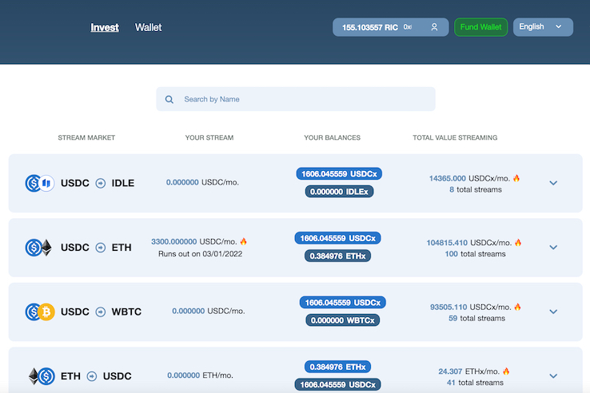

---
title: "Ricochet Exchange"
description: "轻松的实时加密投资。在流中自动买卖加密货币。DCA 具有隐私性、安全性和低费用。"
date: 2022-08-22T00:00:00+08:00
lastmod: 2022-08-22T00:00:00+08:00
draft: false
authors: ["浮尘"]
featuredImage: "ricochet-exchange.png"
tags: ["DeFi","Ricochet Exchange"]
categories: ["nfts"]
nfts: ["DeFi"]
blockchain: "Polygon"
website: "https://ricochet.exchange/"
twitter: "https://twitter.com/ricochetxchange"
discord: "https://discord.com/invite/egu4FZbPBM"
telegram: ""
github: "https://github.com/Ricochet-Exchange/"
youtube: "https://www.youtube.com/channel/UC9zkXC1Gg3XQcpf5RhK-I0g"
twitch: ""
facebook: ""
instagram: ""
reddit: ""
medium: "https://medium.com/ricochet-exchange"
steam: ""
gitbook: ""
googleplay: ""
appstore: ""
status: "Live"
weight: 
lightgallery: true
toc: true
pinned: false
recommend: false
recommend1: false
---
Ricochet 将权力掌握在被动投资者手中。

Ricochet 使投资者能够通过单笔交易设置美元成本平均 (DCA)。用户可以在流中自动买卖加密货币，从而获得隐私、安全和低费用的好处。 

Ricochet 利用第 2 层基础架构（在 Polygon 上运行），并能够使用 Superfluid 的即时分发协议和 ERC777 为其流媒体实现频繁的交换和分发。 

Ricochet 是非托管的、完全自动的和不干涉的，并利用 DeFi 的力量提供轻松的实时加密投资。

