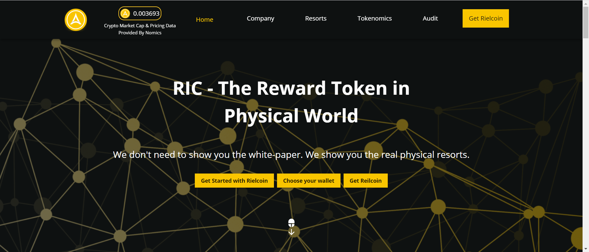

Rielcoin是一种未来的财务自由代币，它为在全球范围内使用加密货币交换和支付提供了功能性代币。该项目的目标是可以与世界各地的各种代币交换以支付其他服务、借贷平台、钱包应用程序的代币，为世界各地的用户提供便利和利益。

Rielcoin (RIC)是一种加密货币，旨在进一步发展区块链网络TRON (TRC-20) 和 Binance Smart Chain (BEP-20) 上的去中心化金融 (DeFi)。

