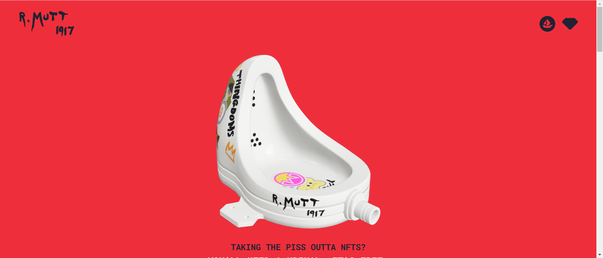

R. Mutt 是 Marcel Duchamp 的著名作品 Fountain 的 2,048 个独特、可模因、3-D 和完全交互的 NFT 模仿的集合。

与 NFT 一样，马塞尔·杜尚的《喷泉》永远改变了公众对艺术的看法。

一个原始模因，它的流行颠覆了传统主义，颠覆了审查制度，并诞生了概念艺术。没有它，就没有沃霍尔、没有赫斯特、没有Goblintown.wtf。

因此，虽然像rektguy这样的收藏品让 NFT 变得不那么受欢迎，但让我们纪念一下开始这一切的小便。

