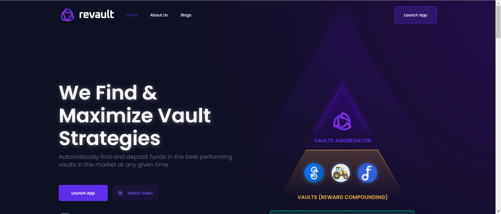

以比特币为首的区块链技术已被证明是现存最诚实、最高效、最安全的全球金融系统。接下来，以太坊引入了去中心化计算，这在历史上首次为全球去中心化金融和治理奠定了基础。DeFi 是我们经济的下一个进化步骤。智能合约接管现有基础设施只是时间问题。Revault 协议的构建主要侧重于在任何区块链上识别、分析和使用最佳收益优化协议（称为保险库），以便为其用户提供他们作为投资者在 DeFi 空间中导航所需的工具。除了寻找最佳投资选择之外，

我们的使命是通过为每个人提供对 DeFi 空间的访问，成为全球经济革命的工具。

