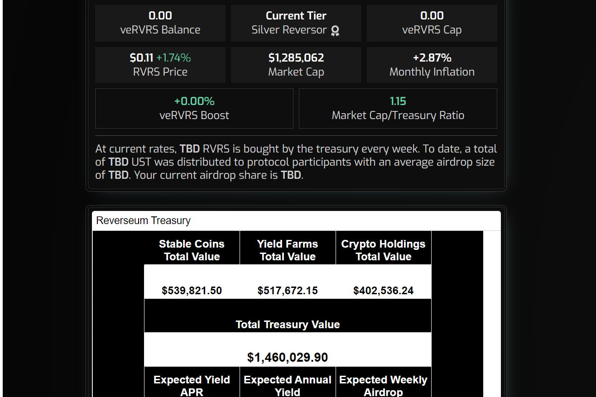

什么是反向？↗

DeFi 2.0 协议，FaaS（农业即服务）通过社区管理的金库为 $RVRS 质押者产生被动收入——利润每周以 $UST 空投。

我们还在自动复合和每周债券池中提供每周 2%的 RVRS 单一抵押。

反向 dapp 建立在 Harmony 区块链上，其资金分布在所有领先的区块链上。

财政部投资于所有主要的 dapps/token，如 CVX、UST、CRV-ETH、JEWEL、GLP (GMX)、TRANQUIL、DEFIRA、MIMAS。

财政部的使用和分配由 RVRS 代币持有者通过治理方案决定。

让您的资金为您服务。让 Reverse 为您抓住最佳机会。↗

