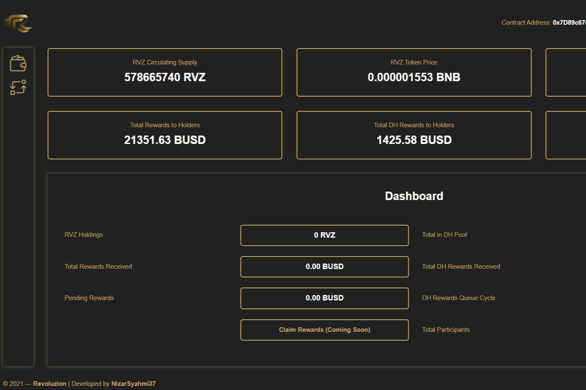

多个 dApp 集成，包括仪表板、投资组合、dex 互换和买入/卖出限价单。

Multi-DApp 生态系统的未来就在这里，一场革命！全面的 DApp 集成，包括我们基于网络的 Play-to-Earn 游戏 Apocalypse。我们是您投资的唯一明智选择！

Revoluzion (RVZ) 是建立在高效的币安智能链上的 DeFi 代币。我们的愿景是提供多个完全集成的 dApp，以提供最大的效用：用于监控代币和投资者分析的仪表板、多功能投资组合查看器、带有集成图表的去中心化交易所交换、买入订单和卖出限制以及更多集成到不远的将来。

