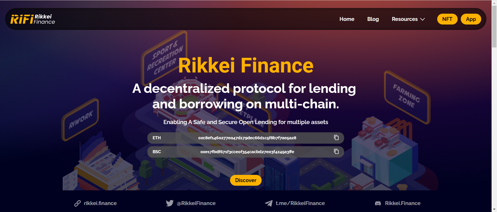

Rikkei Finance是一个具有跨平台借贷、NFT 和 P2P 保险的革命性 DeFi 生态系统。

结构良好的 DeFi 协议

在 Rikkei Finance Planet 下，有 5 个主要区域：体育和娱乐中心、农业区、NFT 市场、RiWork 和治理、DAO 和借贷。所有这些最终都将支持 Rikkei Finance 的核心产品 LENDING 的开发。

 通过 NFT 市场解决 NFT 流动性不足

Rikkei Finance NFT Marketplace 以可承受的价格提供高流动性和广泛的 NFT，促进 Rikkei Finance Lending Protocol 的 NFT 抵押。

安全可靠的借贷协议

Rikkei Finance Lending Protocol 采用多种方法来确保系统的可持续性，包括：应用改进的 Multi-kinked 利率模型，采用 5 阶段资产选择过程，这将消除价格调整和市场操纵的风险，使 RIFI 系统能够可持续地响应任何市场情况。

