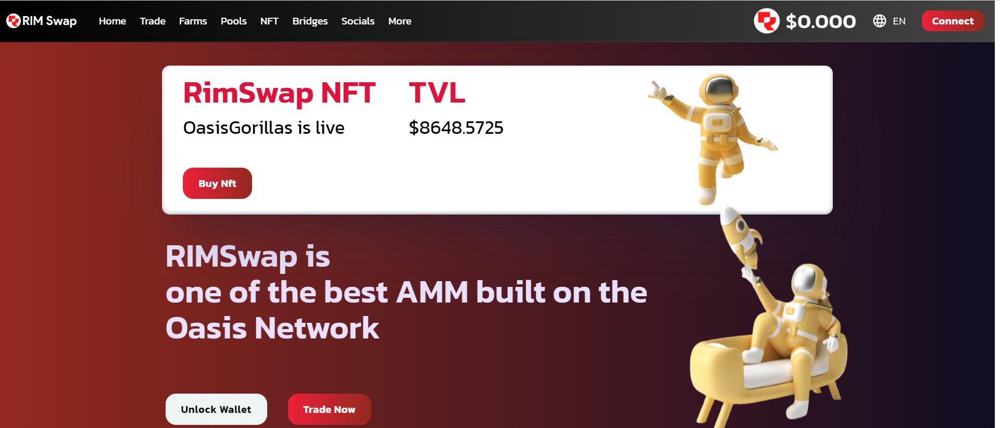

RIMSwap 是最早建立在 Oasis Emerald 网络上的自动做市商 (AMM)、去中心化交易所 (DEX) 之一。支持一系列服务和功能，它可以让您交换加密资产，通过质押和收益耕作、NFT 获得被动收入，甚至在 Oasis Emerald 网络上启动您自己的加密项目。它是 Oasis 网络上的一站式 DeFi Hub。我们的目标是提供快速、安全和廉价的服务来交换绿洲翡翠内的代币。 

RIMSwap 由 Paladin 审核。 

#OasisGorillas NFT 是 RIMSwap DEX 生态系统的一部分。每周，30% 的 AMA 交易费用将分配给 OasisGorilla NFT 持有者。

