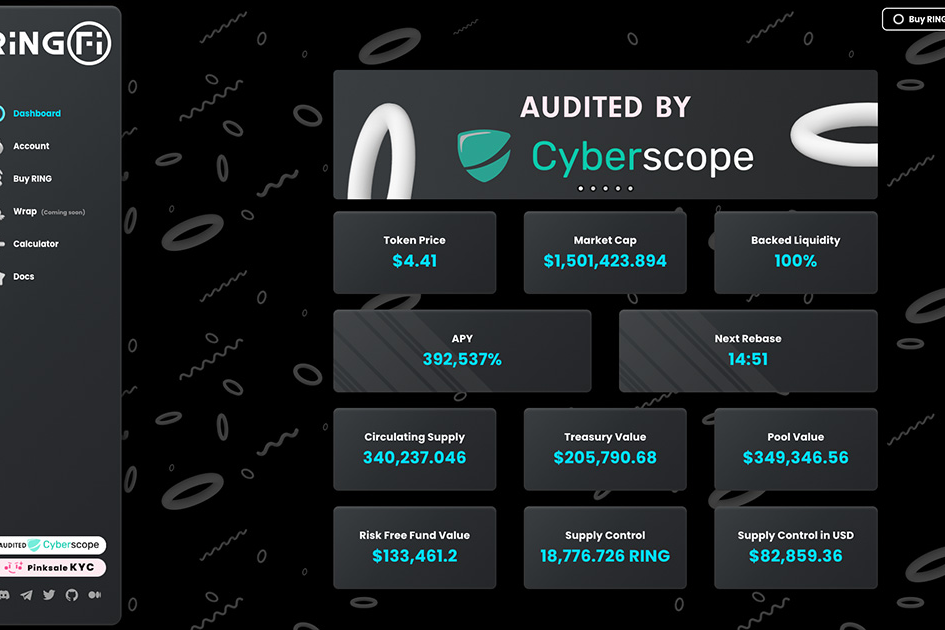

RingFi 是BSC 网络上的下一代 DeFi版本，旨在以最简单和最可持续的方式获得被动回报。

其背后的代币模型是“循环经济”概念的实验性方法，由持有代币的自动质押功能加上随着时间推移可持续并由资金储备支持的固定 APY 组成。

$RING 代币的目标很简单，即建立一种在未来几年仍然存在的加密储备货币，并成为未来生态系统的基础，提供一系列加密产品和服务，所有这些都建立在强大的基础之上一致的高APY奖励。

$RING 的代币经济学旨在确保项目的永久可持续性。$RING 持有者收到的奖励来自每次交易 $RING 时向每个用户收取的费用，无论是通过买入还是卖出。该金额计入一个特殊的钱包，旨在通过算法支持 $RING 中的 rebase 奖励。

RingFi 的竞争优势在于其独特的机制，例如每 24 小时自动流动性，以及可组合性，这要归功于 wRING，它允许用户使用 $RING 进行耕种并将其用作抵押品，同时仍能获得 rebase。此外，在安全标准方面，Cyber​​Scope 进行了一次审计，该团队已通过 KYC 进行粉销并锁定流动性 100 年。如果您有任何问题，请随时与 Discord 团队联系。

