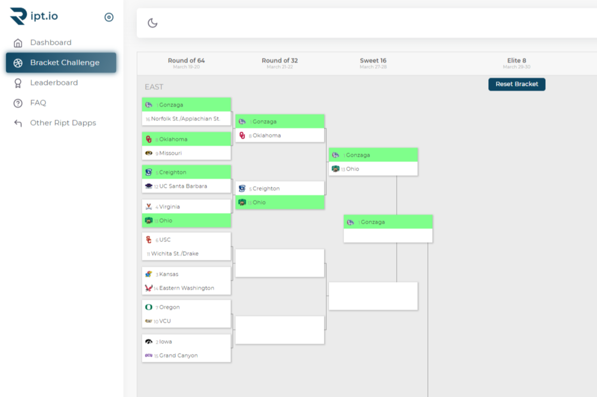

智能合约启用了 March Madness 括号选择 dapp。只需导航到 Ript 并选择您的支架。如果您选择最正确的选项，您将赢得您的底池！

Ript是一个去中心化的 dApp 仓库。我们构建和支持我们自己的所有去中心化应用程序，未来会有几十个，与其他去中心化应用程序不同，所有应用程序都是 100% 去中心化的。这意味着我们不会存储有关您的任何数据，并且所有数据库控制都在所有智能合约内安全地完成。这是我们的愿景，由于高昂的汽油费，这在以太坊网络上是不现实的，这就是为什么 Harmony 是一个如此理想的候选人。

