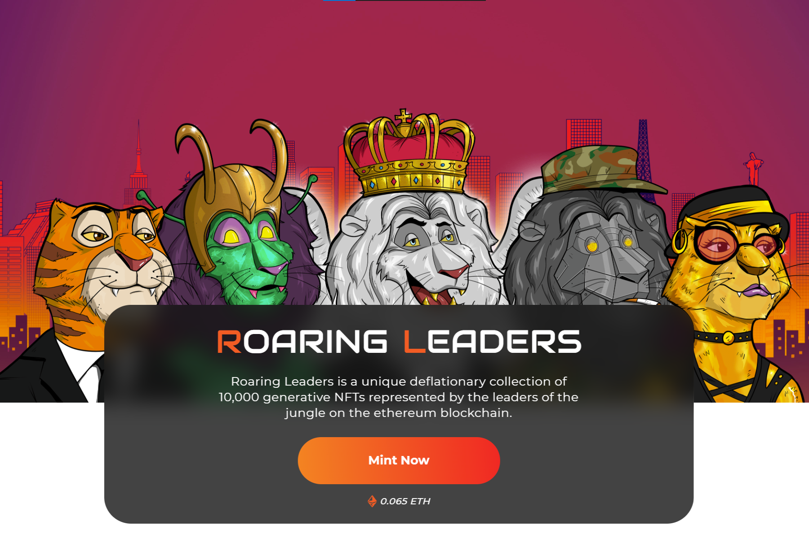

---
title: "Roaring Leaders"
description: "🦁 10,000 个通缩生成 NFT 🚀有史以来第一个被称为“领导者基金”的 NFT 共同基金。"
date: 2022-08-23T00:00:00+08:00
lastmod: 2022-08-23T00:00:00+08:00
draft: false
authors: ["浮尘"]
featuredImage: "roaring-leaders.png"
tags: ["Collectibles","Roaring Leaders"]
categories: ["nfts"]
nfts: ["Collectibles"]
blockchain: "ETH"
website: ""
twitter: "https://twitter.com/RoaringLeaders"
discord: "https://discord.com/invite/roaring"
telegram: ""
github: ""
youtube: "https://www.youtube.com/channel/UCO_p5XABABQGDzterrWfWEQ"
twitch: ""
facebook: ""
instagram: "https://www.instagram.com/roaringleaders/"
reddit: ""
medium: ""
steam: ""
gitbook: ""
googleplay: ""
appstore: ""
status: "Live"
weight: 
lightgallery: true
toc: true
pinned: false
recommend: false
recommend1: false
---
Roaring Leaders 是以太坊区块链上 10,000 个可生成 NFT 的独特通缩集合。该系列包括首个 NFT 共同基金，称为 Leaders' Fund。

我们的艺术作品包括约 200 多种手工制作的特征，以捕捉定义以丛林中的狮子和老虎为代表的世界领袖的精神和能量！

Staking 在 NFT 中是一个相当新的概念，它让持有者能够从他们的资产中看到直接的有形回报。通过质押你的 NFT，它们被锁定（你不能出售或列出它们），你每天可以赚取 10 美元的 ROAR。

您可以随时取消质押，在质押期间，您可以获得 $ROAR，它有多种用例，包括育种、丛林商店物品、独家薄荷糖和商品。

