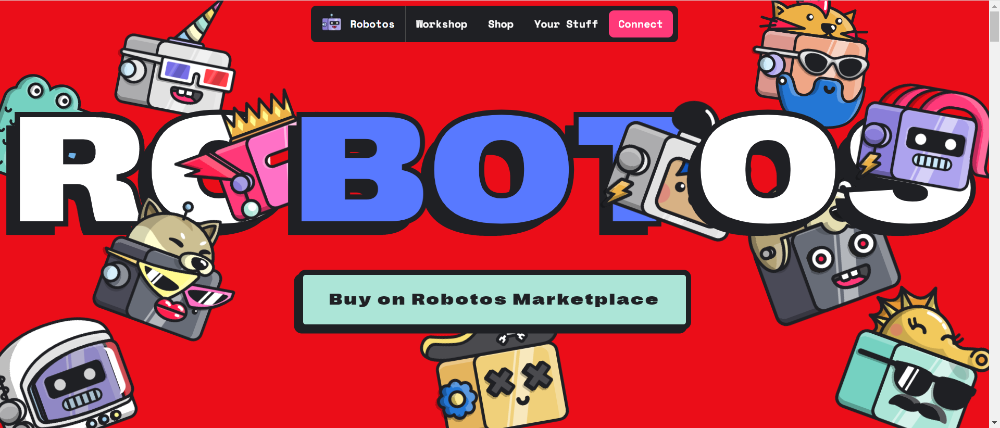

Robotos 是由 Pablo Stanley 设计并铸造为 NFT 的机器人角色集合。它们由各种金属服装、锡面、数码配件、上衣、脸、背包、武器和颜色构成。得到你自己的！

Robotos 是由Pablo Stanley设计并在以太坊区块链上作为 NFT 铸造的算法生成的机器人角色集合。第一代 10,000 个机器人将由各种金属服装、锡面、数码配件、上衣、面孔、背包、手臂和颜色构成。机器人有不同的体型，有些比其他的更罕见，而且……有传言说你也可以发现人类伪装成机器人。

