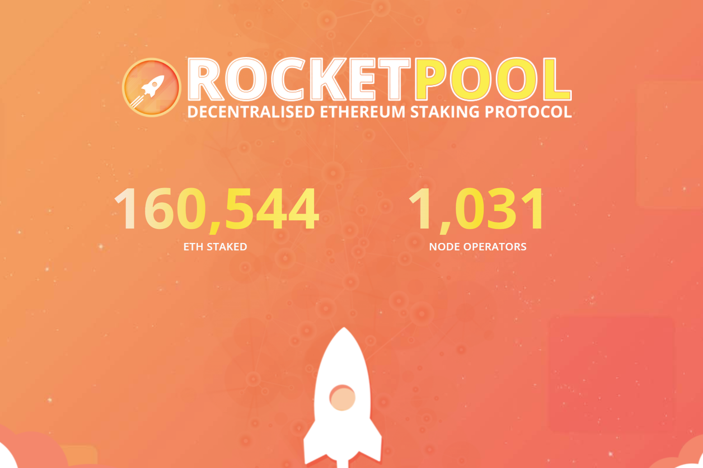

---
title: "Rocket Pool"
description: "去中心化以太坊质押协议🚀"
date: 2022-08-23T00:00:00+08:00
lastmod: 2022-08-23T00:00:00+08:00
draft: false
authors: ["浮尘"]
featuredImage: "rocket-pool.png"
tags: ["DeFi","Rocket Pool"]
categories: ["nfts"]
nfts: ["DeFi"]
blockchain: "ETH"
website: "https://rocketpool.net/"
twitter: "https://twitter.com/Rocket_Pool"
discord: "https://discord.com/invite/rocketpool"
telegram: ""
github: "https://github.com/rocket-pool"
youtube: "https://www.youtube.com/rocketpool"
twitch: ""
facebook: ""
instagram: ""
reddit: "https://www.reddit.com/r/rocketpool"
medium: "https://medium.com/rocket-pool"
steam: ""
gitbook: ""
googleplay: ""
appstore: ""
status: "Live"
weight: 
lightgallery: true
toc: true
pinned: false
recommend: false
recommend1: false
---
Rocket Pool 是第一个真正去中心化的以太坊质押池。流动质押、经审计的 SC 和最小化的处罚风险。与单独的质押者不同，他们需要存入 32 ETH 以创建新的验证者，Rocket Pool 节点只需为每个验证者存入 16 ETH。这将与来自质押池的 16 个 ETH（质押者存入以换取 rETH）相结合，以创建一个新的 ETH2 验证器。

