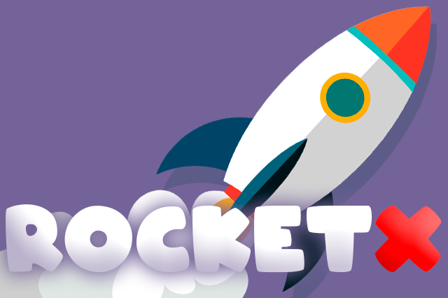

---
title: "RocketX Miner"
description: "RocketX.Cash Binance 基于智能链的经过验证的审计合约支持使用 BNB (BEP-20)"
date: 2022-08-23T00:00:00+08:00
lastmod: 2022-08-23T00:00:00+08:00
draft: false
authors: ["浮尘"]
featuredImage: "rocketx-miner.png"
tags: ["High risk","RocketX Miner"]
categories: ["nfts"]
nfts: ["High risk"]
blockchain: "BSC"
website: "https://miner.rocketx.cash/"
twitter: "https://twitter.com/rocketx_cash"
discord: ""
telegram: "https://t.me/rocketx_official"
github: ""
youtube: ""
twitch: ""
facebook: ""
instagram: ""
reddit: ""
medium: ""
steam: ""
gitbook: ""
googleplay: ""
appstore: ""
status: "Live"
weight: 
lightgallery: true
toc: true
pinned: false
recommend: false
recommend1: false
---
为什么 RocketX 与任何其他矿工不同？

RocketX 不仅仅是一个硬币或一个矿工。这是一个令人兴奋的生态系统，代币为矿工提供资金，矿工为代币提供资金，百分比也被投入到其他形式的被动收入中，这些被动收入已经持续了一段时间，这些利润也被用于生态系统，所以有了这个生态系统到位，这是矿工和代币被抽出的永无止境的循环。RocketX 旨在通过一个每天为银行提供食物的智能生态系统持续很长时间。这是众所周知的被动收入平台的修改版本，将确保矿工的寿命和可持续性。

币安智能链上每个区块（约 3 秒）支付的收益从 30 天到 365 天不等。
365 每日最低2.5%至 30 天每日 4% 的短期收益率。
用户可以推荐任何级别的无限用户，最多支付 10 个级别，从10%到总共高达18%的无限制收益潜力
每个区块支付的种子收入和高达77.3%的推荐红利产生收入，这又是不受限制的收入潜力。
安全、透明、合法、去中心化的永无止境的农场收益。
低开发费 5%。

