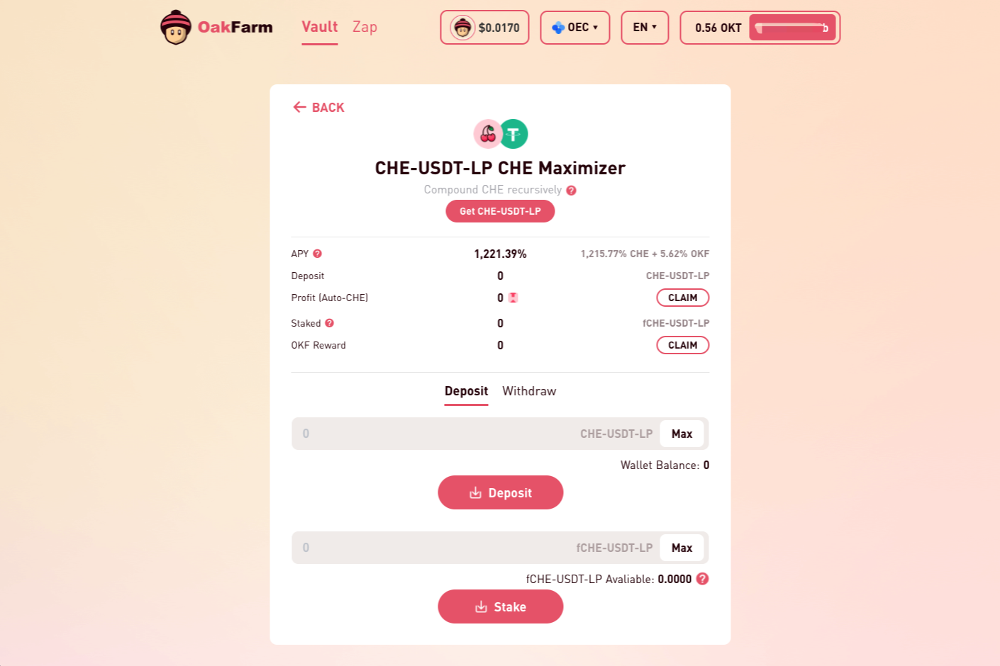

**什么是OakFarm？**

OakFarm是一个高频产量农业优化器，仅在OKExChain（OEC）和Binance Smart Chain（BSC）上运行。

它会自动将用户存入的资产放入利润最高的矿池中。OakFarm每分钟都会努力工作，以便农民可以享受多汁的复合效果。

OKF（OakFarm.io）令牌是用于OakFarm项目的州长和激励令牌。它是作为奖励为我们的采矿用户发放的。

