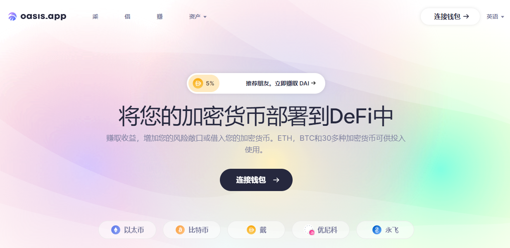

**什么是Oasis？**

Oasis是访问Maker Protocol并创建Dai的前端。Oasis Borrow旨在成为Maker协议最受信任的入口点。长期使命是允许用户简单轻松地将他们的资金部署到DeFi中，并在一个值得信赖的地方进行管理。

Maker协议由分散的稳定币，抵押贷款和社区治理组成。

Oasis的使命是提供最佳和最值得信赖的切入点来部署您的资本。我们正在构建 Oasis.app，让我们的用户从DeFi的所有潜力中受益。我们的团队由充满激情的思想家和建设者组成。

