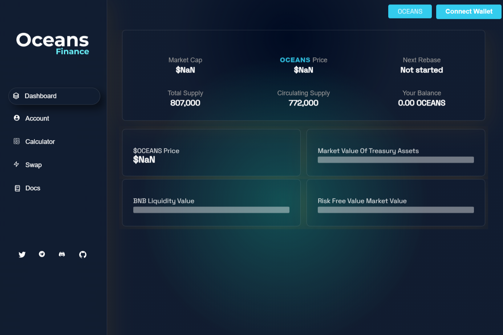

---
title: "Oceans Finance"
description: "多链自动质押和自动复合 DEFI 3.0 协议"
date: 2022-08-18T00:00:00+08:00
lastmod: 2022-08-18T00:00:00+08:00
draft: false
authors: ["june"]
featuredImage: "oceans-finance.png"
tags: ["High risk","Oceans Finance"]
categories: ["nfts"]
nfts: ["High risk"]
blockchain: "BSC"
website: "https://bsc.oceans.finance/?utm_source=DappRadar&utm_medium=deeplink&utm_campaign=visit-website"
twitter: "https://twitter.com/oceans_finance"
discord: ""
telegram: ""
github: ""
youtube: ""
twitch: ""
facebook: ""
instagram: ""
reddit: ""
medium: ""
steam: ""
gitbook: ""
googleplay: ""
appstore: ""
status: "Live"
weight: 
lightgallery: true
toc: true
pinned: false
recommend: false
recommend1: false
---

**什么是海洋金融？**

多链自动质押和自动复合 DEFI 3.0 协议

Oceans Finance提供了一种分散的金融资产，通过使用其独特的协议，以可持续的固定复利模型奖励用户。是什么让海洋金融与众不同？

✅稳定币$OCASH 1：1与$BUSD（收益农业，质押）✅包装$wOCEANS兼容的CEX交易所✅代币$CCEANS具有$BUSD奖励✅多链&nbsp;的可证实的APY。

