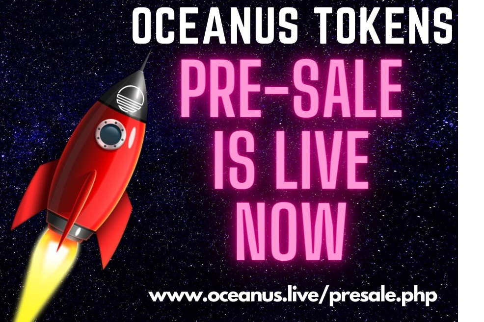

**什么是Oceanus？**

Oceanus是币安智能链上一个无缺陷的高收益代币，行动不言自明，因为我们的商业模式将收取8%的交易费用（6%-持有者和2%-LP），其中持有者/投资者将成为所有交易的受益人。我们将按阶段将代币烧成惊人的51%，以加强我们的社区。有了超音速的象征主义，我们必然会见证成倍的增长，走向月球。

Oceanus由Binance Smart Chain（BSC）提供支持。超高速，移动性和最低的汽油费，允许用户使用任何钱包获得最佳的投资选择。

