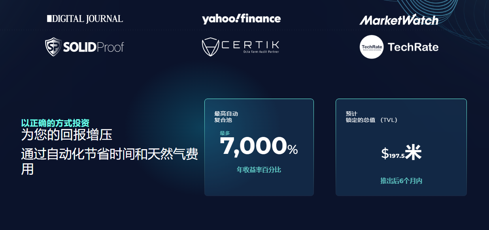

**什么是Octafarm？**

Octafarm是币安智能链（BSC）上的自动复利收益聚合器，旨在通过自动化再投资流程来简化收益农业生命周期，以最大限度地提高收益潜力。

Octafarm旨在成为复杂和非复杂用户以自动化，简单和安全的方式访问DeFi收益农业世界的最简单网关。

**面向所有人的跨链收益农业。**

Octafarm将部署在各种区块链网络上，因此任何人都可以无缝地跨链访问增压收益，从而最大限度地提高获得最高收益的机会。

