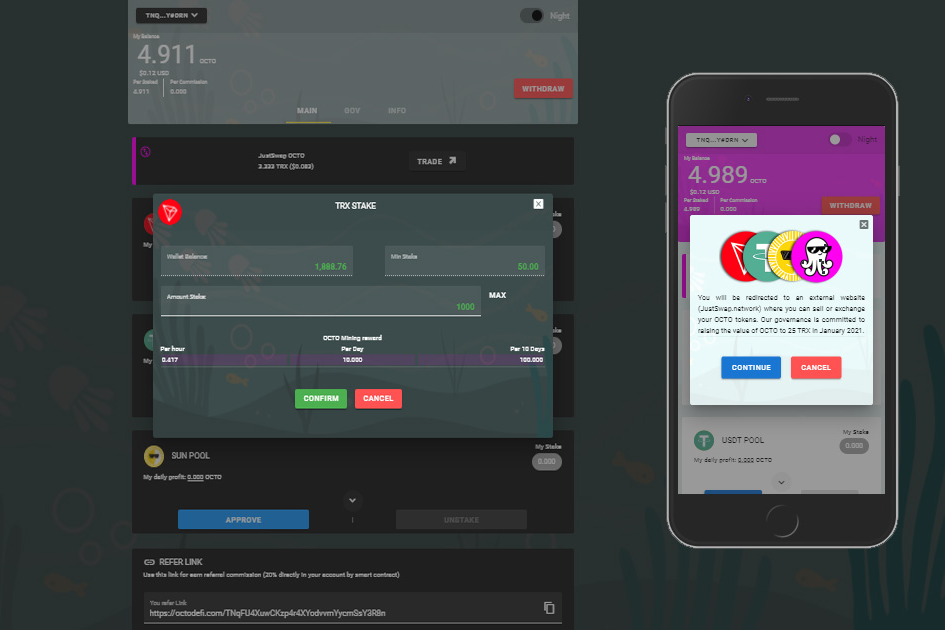

**什么是OctoFi？**

OctoFi在您与最受信任的去中心化金融（DeFi）和不可替代代币（NFT）市场进行交易时为您提供现金返还。

有利可图的采矿，每秒分发一次，并随时取消TRX。OCTO DeFi将由社区管理，没有预挖矿，没有ICO。代币将通过挖矿获得奖励。挖矿是通过押注TRX，USDT或SUN代币进行的，用于在JustSwap上提供流动性。

Octo令牌总共限制为20，000，000个令牌。您越早加入Octo DeFi，您将获得的价值就越多。OCTO代币与TRX，USDT或SUN的交换将在JustSwap平台上提供。开采的代币价格可能会随着时间的推移而变化。

