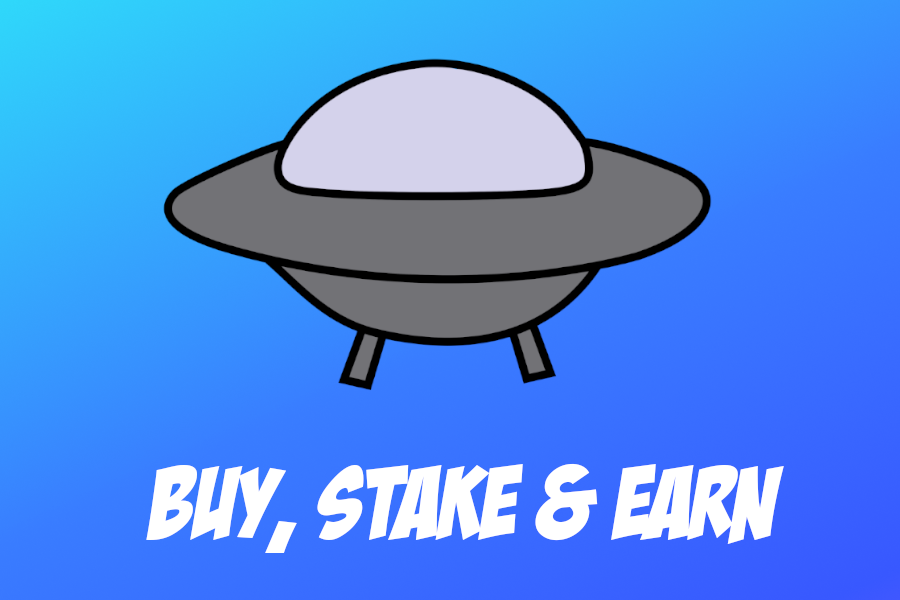
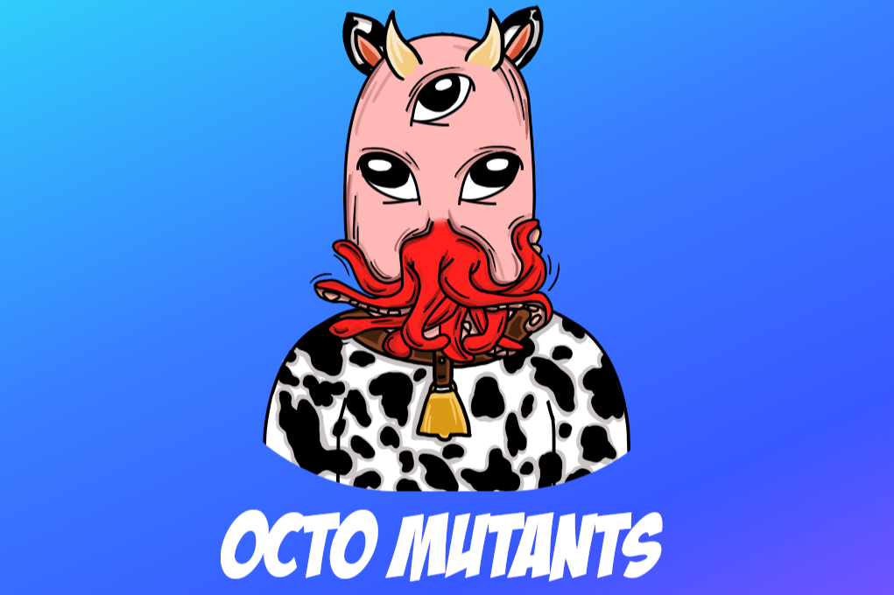

**什么是OctoAliens？**

OctoAliens是BSC上的NFT DeFi项目。

在AirNFT上从一级市场购买OctoAliens NFT，赚取$OCTO并将其抵押到我们的DApp中。

**币安智能链上的热门硬币之一是OctoAliens（octo）。**

该硬币目前的价值不是很高。OctoAliens （octo） 的价格是 $0.000022592314$。加密代币的价格非常动态，会立即发生变化。如果您想了解octo代币的最新价格，CoinsGem.com 是最好，最可靠的信息来源。OctoAliens目前的市值为275K $，交易量为4，475.49$。

