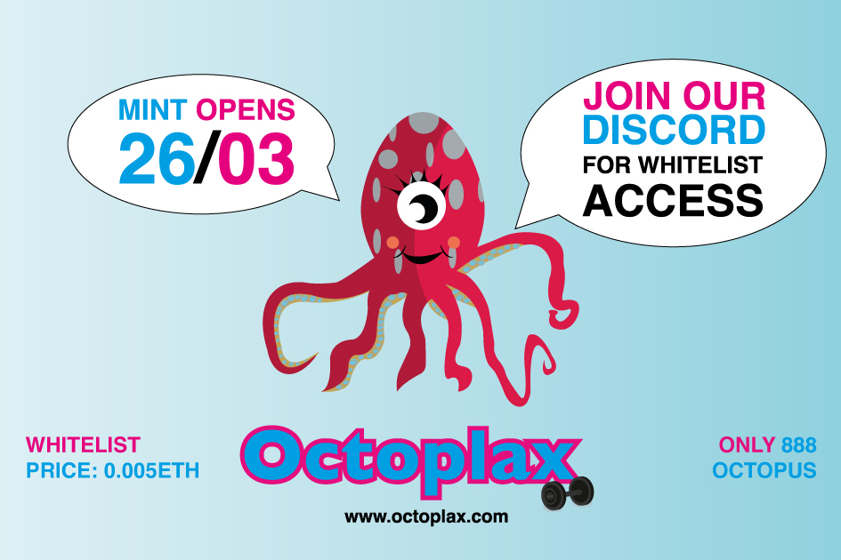

**什么是Octoplax？**

Octoplax是以太坊区块链上888个放松生成章鱼NFT的独特集合。

每只章鱼都是独一无二的，该系列由70层手工制作的矢量组成，充满了大胆，充满活力，令人振奋的色彩，每个色彩都与集体爱好项目合作，例如：滑板，篮球，植物，品脱啤酒等等......

在Octoplax，我们计划兑现承诺和超额交付。快来加入我们的不和谐，了解我们最新的赠品，并访问白名单。

放松一下！拿起一张古怪的个人资料图片。和平！

白名单打开时间：26/03/22 - 28/03/22 （0.005 eth）

预售开盘及揭晓日期：28/03/22 - 01/04/22 （0.008 eth）

公开发售：01/04/22（0.01 eth）

