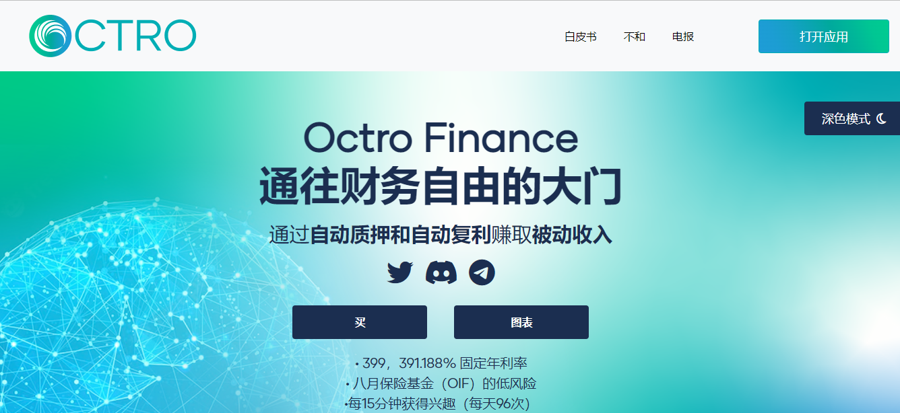

---
title: "Octro Finance"
description: "Octro提供了一个分散的金融资产，通过使用其OAP协议，以可持续的固定复利模型奖励用户。"
date: 2022-08-18T00:00:00+08:00
lastmod: 2022-08-18T00:00:00+08:00
draft: false
authors: ["june"]
featuredImage: "octro-finance.png"
tags: ["High risk","Octro Finance"]
categories: ["nfts"]
nfts: ["High risk"]
blockchain: "BSC"
website: "https://octro.finance/?utm_source=DappRadar&utm_medium=deeplink&utm_campaign=visit-website"
twitter: "https://twitter.com/OctroFinance"
discord: ""
telegram: ""
github: ""
youtube: ""
twitch: ""
facebook: ""
instagram: ""
reddit: ""
medium: ""
steam: ""
gitbook: ""
googleplay: ""
appstore: ""
status: "Live"
weight: 
lightgallery: true
toc: true
pinned: false
recommend: false
recommend1: false
---

**什么是OCTRO？**

OCTRO是支付利息再基地奖励的原生代币。每个代币持有者每15分钟自动获得0.02394%的利息，只需在自己的钱包中持有$OCTRO代币！

OIF作为一个保险基金，通过保持支付给所有代币持有者的一致的0.02394%的再基利率，实现Octro协议的价格稳定和长期可持续性 $OCTRO。

所有交易$OCTRO中有3%在熔炉中燃烧。交易越多，投入火中的越多，导致炉子尺寸变大，从而减少了循环供应并保持Octro协议稳定。

Crypto支付最高的自动质押和自动复合协议，具有业内最大的固定APY，为399，391.188%。持有任何$OCTRO代币的每个平衡计分卡钱包每15分钟复利一次。

财政部在$OCTRO代币价格大幅下跌的情况下向OIF提供支持。财政部还为Octro的投资，新的Octro项目和营销提供资金。

虚拟数字人都迎来了一股发展热潮。

