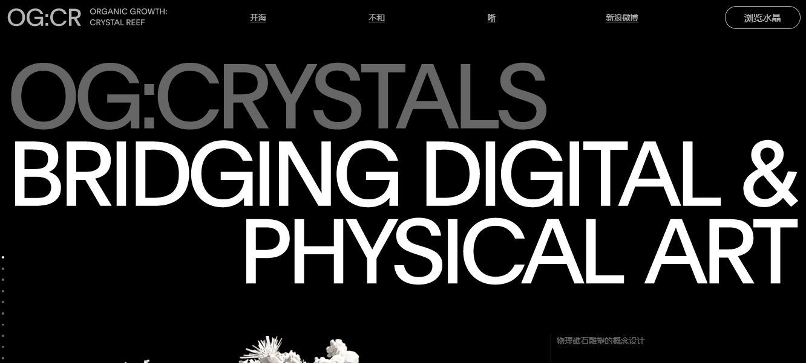

**什么是OG：水晶？**

探索有机生长的非凡世界：水晶礁，10301独特的NFT收藏品，每次从其他收藏家处购买时都会变形和成长。这个革命性的数字艺术项目是艺术家Michael Joo（ASomatica）和Danil Krivoruchko（Myshli）之间的合作。

每个OG：Crystal的刻面和轮廓都是通过算法生成的，是每个所有者的加密钱包历史以及无数晶体结构组合的产物。

在初始销售日期或七代增长两个月后，每个OG：Crystal将被“锁定”，任何新交易都不会影响形状，结构或稀有性。

