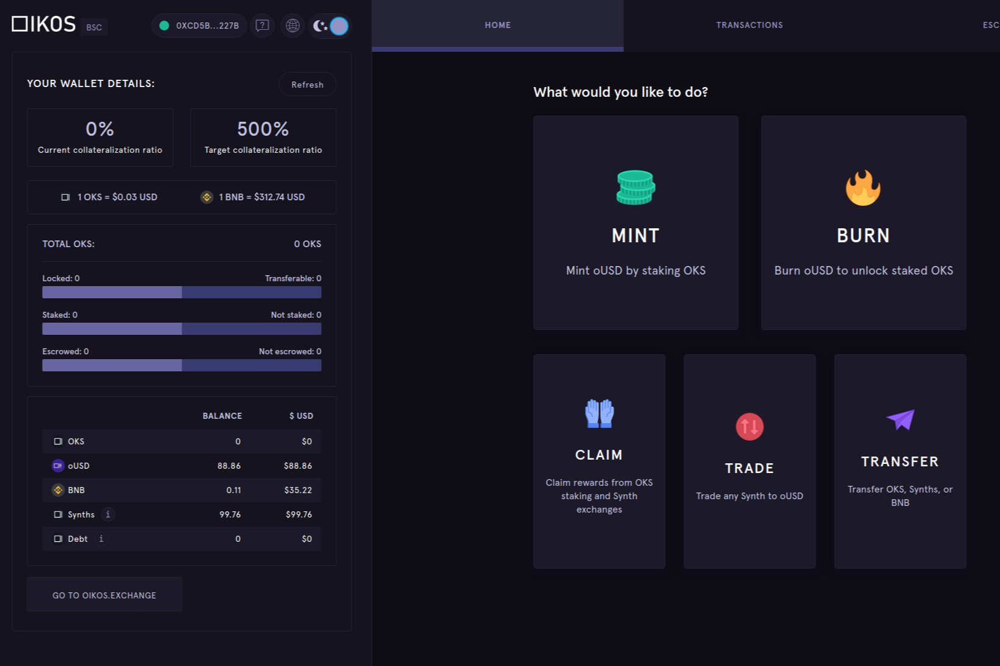

**什么是Oikos.cash平衡计分卡？**

分散式合成资产Oikos是Synthetix的币安智能链端口：一个合成资产平台，提供货币，商品和指数的链上敞口。

合成资产（Synths）由Oikos网络代币（OKS）支持，该代币作为抵押品锁定在智能合约中。Synths跟踪各种资产的价格，允许加密原生和无银行账户的用户在Oikos交易所交易P2C（点对合约），而不受流动性限制。

Oikos是一家基于BSC的合成资产平台，提供法定货币、商品、股票和指数的區塊链上交易。合成资产（Synths）由OKS作为抵押物，作为智能合同的担保。Synths跟踪各种资产的价格，允许加密用户和无银行用户在Oikos交易所上交易P2C（对等合同），而不受流动性限制。

