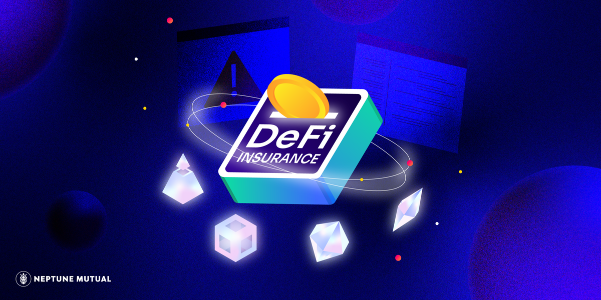

Neptune Mutual 为您提供有保障的稳定币流动性，通过对冲可能的资本风险和智能合约漏洞来降低您的风险敞口。

Neptune Mutual 平台探索在区块链上创建以用户为中心的对冲产品的新途径。我们的目标是通过创建基于稳定币的覆盖池来进行准确的风险管理，从而为**币安智能链**吸引稳定的用户群和不断增长的流动性。

Neptune Mutual 平台将 NEP 代币用于治理和实用目的。

- 使用 NEP 质押并创建合约和市场
- 燃烧 NEP 以创建合约和市场
- 使用 NEP 对平台未来的治理进行投票
- 锁定 NEP 以提供流动性、保护协议并产生额外奖励
- 将 NEP 放入您的钱包以购买和索赔保险

