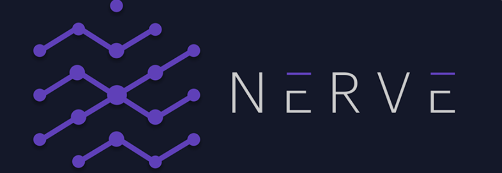

---
title: "Nerve"
description: "Nerve是一款StableSwap AMM，旨在以最小的滑动速度快速交易stablecoins和挂钩合成资产。"
date: 2022-08-18T22:00:00+08:00
lastmod: 2022-08-18T10:00:00+08:00
draft: false
authors: ["Cindy"]
featuredImage: "nerve.png"
tags: ["Exchanges","Nerve"]
categories: ["nfts"]
nfts: ["Exchanges"]
blockchain: "BSC"
website: "https://nerve.fi/"
twitter: "https://twitter.com/NerveFinance"
discord: "https://discord.com/invite/4XEyjqJ2by"
telegram: ""
github: ""
youtube: ""
twitch: ""
facebook: ""
instagram: ""
reddit: ""
medium: "https://nervefinance.medium.com/"
steam: ""
gitbook: ""
googleplay: ""
appstore: ""
status: "Live"
weight: 
lightgallery: true
toc: true
pinned: false
recommend: false
recommend1: false
---
Nerve是一款StableSwap AMM，旨在以最小的滑动速度快速交易stablecoins和挂钩合成资产。

我们在Binance智能链上推出Nerve，因为BSC允许我们实现DeFi的真正价值：民主化和无限制地获取金融。与许多近期专注于短期优化的项目不同，我们正在鼓起勇气，打造一个长期的DeFi和BSC生态系统核心。