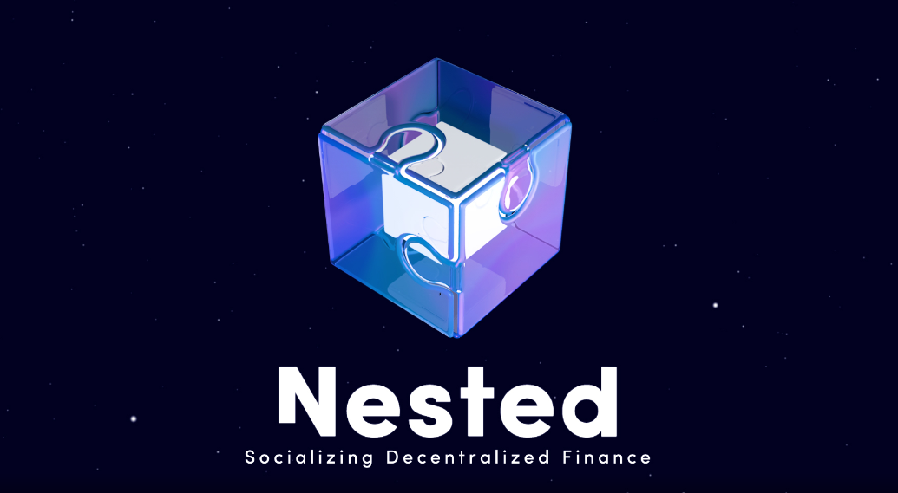
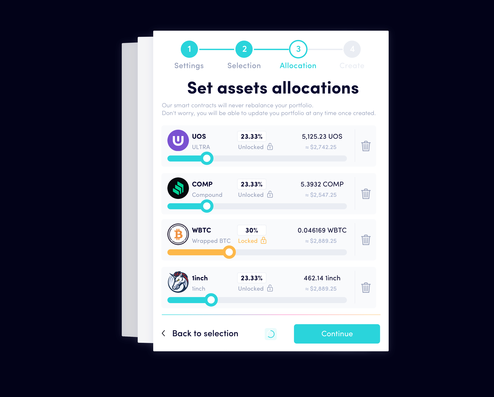

---
title: "Nested"
description: "Nested是一个社交交易平台，旨在将DeFi社交化。"
date: 2022-08-18T22:00:00+08:00
lastmod: 2022-08-18T10:00:00+08:00
draft: false
authors: ["Cindy"]
featuredImage: "nested.png"
tags: ["DeFi","Nested"]
categories: ["nfts"]
nfts: ["DeFi"]
blockchain: ""
website: "https://nested.fi/"
twitter: "https://twitter.com/NestedFi"
discord: "https://discord.com/invite/VW8ZZsACzd"
telegram: "https://t.me/NestedFinanceChannel"
github: "https://github.com/NestedFi/nested-core-lego"
youtube: "https://www.youtube.com/channel/UCjOGRY8UjYoNvLBJtyZWmCw/featured"
twitch: ""
facebook: "https://www.facebook.com/Nested.fi"
instagram: ""
reddit: "https://www.reddit.com/r/nested/"
medium: "https://nestedfi.medium.com/"
steam: ""
gitbook: ""
googleplay: ""
appstore: ""
status: "Live"
weight: 
lightgallery: true
toc: true
pinned: false
recommend: false
recommend1: false
---
Nested是一个社交交易平台，旨在将DeFi社交化。

在社交媒体和DeFi交易的十字路口，Nested是多链的，按规模构建，允许用户创建、复制、管理、更新、发送和共享加密策略-“嵌套投资组合”。

这些金融投资组合被表示为反映代币集合的不可替代代币（NFT）。Nested使加密新手和经验丰富的交易者能够相互受益。第一种可能会寻找执行策略和投资组合进行复制，而第二种可能会通过每次追随者确实复制他们的投资组合时赚取版税来将他/她的知识货币化。

在未来几个月内，Nested还将允许用户复制耕作和赌注策略

Nested的团队致力于构建以用户为中心的应用程序，同时保持最高级别的分散化和安全性。

