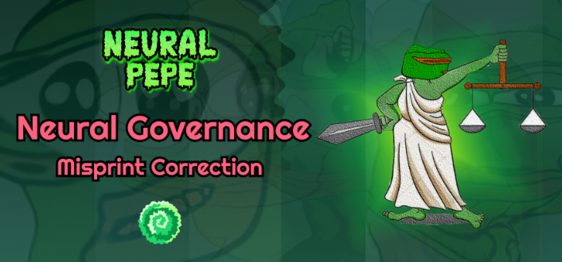

Neural Frens 是一个生态系统，包含 AI 生成的内容和 NFT 的实验。该生态系统由称为 AI 的可替代 BEP-20 代币提供支持，并建立在 7,777 只 AI 生成的模因青蛙（也称为 NP）的创世 NFT 集合之上。NP 是唯一能够生成新 AI 代币（每天 2.3 个 AI）的 NFT。AI 代币被用作各种 Neural Frens 集合的治理代币和支付手段，以及在 Neural Fren 平台上使用各种工具。