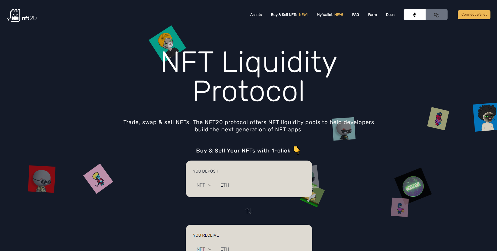

NFT20 是一种去中心化交易所和协议，用于将 NFT 项目标记为 ERC20 代币，使其可在 UniSwap 或 Sushiswap 等去中心化交易所进行交易。任何人都可以将他们的 NFT 添加到适当的池中，并获得代表该 NFT 项目的 ERC20 代币衍生品，这些衍生品可以立即在 dexes 上进行交易。通过创建 NFT 的 ERC20 衍生品二级市场，NFT20 希望解决 NFT 领域的流动性问题。解决这个问题可以提供套利机会，允许投资者在不识别和购买单个 NFT 的情况下获得 NFT 项目的价格敞口，并允许收藏家和新手等更公平的价格设定和更轻松的 NFT 交易。