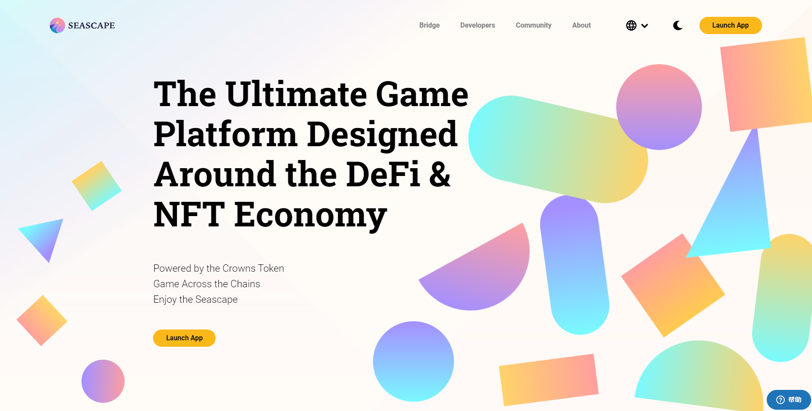

NFT Brawl 是 Seascape Network 最新推出的 DeFi 游戏。在其中，用户可以花费 Crowns (pCWS) 来获得 Seascape 的原始 NFT，Scapes。获得各种品质的花葶，每铸造五次就获得一次暴击！感受 NFT 和 DeFi 的真正威力！

Seascape Network专注于可用性和质量，旨在创造一个环境，让用户、开发人员和利益相关者以激励的方式玩、赚和分享体验。该网络旨在以一种有趣和引人入胜的方式提供区块链和相关金融的自我教育方法。

通过从头到尾的游戏化过程并消除复杂障碍，Seascape网络将允许用户无缝进入区块链游戏和去中心化金融的世界，从财务上激励游戏时间和游戏开发。