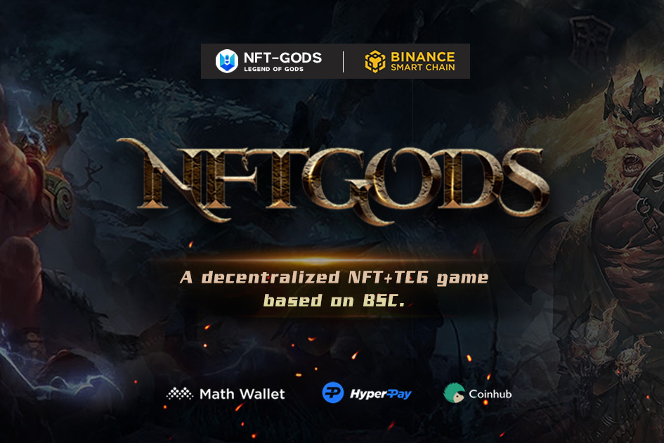
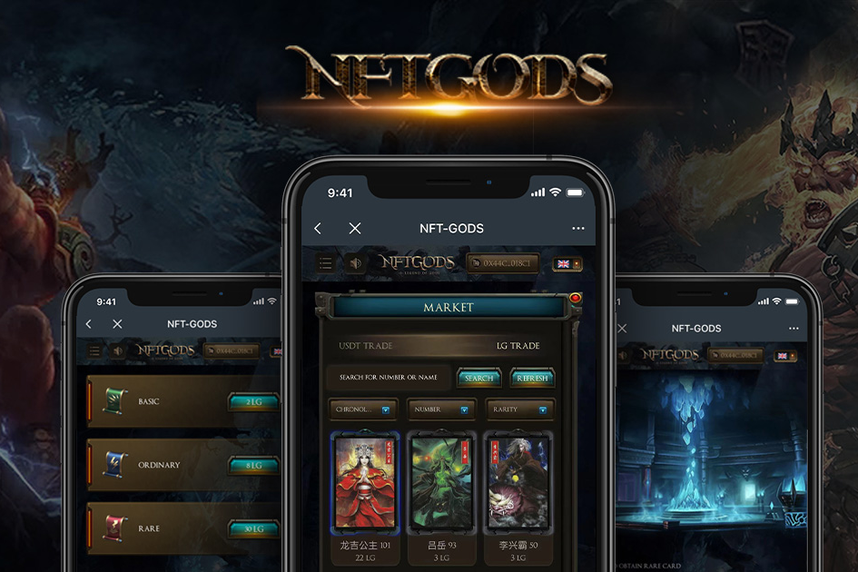

NFT-GODS是第一个具有全球神文化的去中心化TCG Dapp。结合盲盒抽卡、NFT卡挖矿、卡牌重组、战略竞技、流动性提供者挖矿、师徒制以及公共社区打榜等玩法。他们可以带来内容丰富、可玩性高的沉浸式 NFT 游戏体验。

LG是NFT-GODS生态系统中唯一的代币，通过卡片挖矿、LP流动性挖矿等方式产生的代币总量为2000万枚。除了用来买卡和参与LP挖矿，持有LG代币还能让你对NFT-Gods应用衍生平台产生额外的兴趣。
