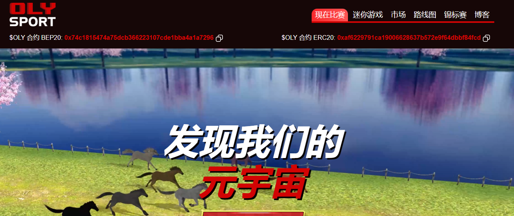

**什么是 奥利运动？**

Oly Sport 开启了 NFT 赛马时代——一个在线赛马游戏平台，使用不可替代代币 (NFT) 作为游戏内资产，并使用区块链支持的代币作为货币。Oly Sport 是一款赚钱游戏，为玩家创造投资和赚钱的机会。我们有自己的货币和政府。

通过将区块链、赛马和房地产相结合，Oly Sport 正在构建一个虚拟世界，彻底改变游戏、统一金融市场并改变土地所有权的观念——所有这些都在一个游戏中完成。请务必注意，我们不是赌博/博彩游戏，因为在许多国家/地区，赌博在文化和道德上不被接受。

